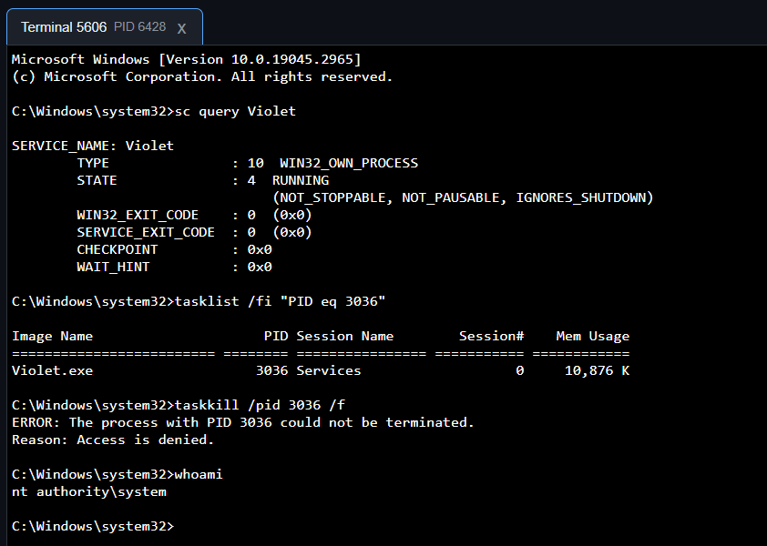
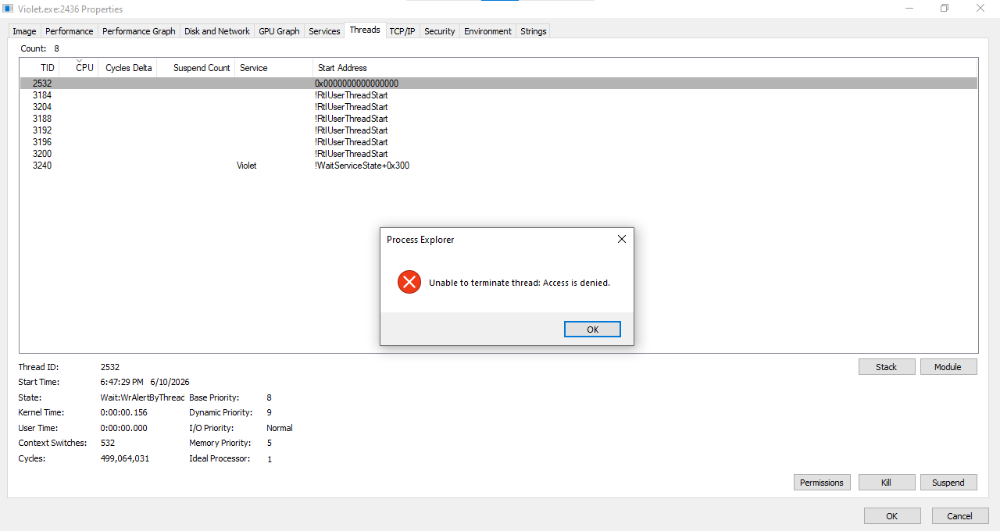

# remote-access-trojan

A Remote Access Trojan (RAT) with UEFI persistence, fully implemented in Rust.

## Features

- Reverse TCP shell for both Windows and Linux.
- Terminal frontend using [xterm.js](https://xtermjs.org/) in operator control panel.
- OpenAPI-based HTTP/2 management API, which can be easily integrated with another web frontend.
    - With the help of `rustls`, OpenSSL is completely not required for the malware to work.

### Windows-only

- Kernel-mode self-defense: preventing process and thread from being intervened, terminated or killed.
- Survive OS reinstall (but not hard-disk wipe unfortunately, though who would delete their ESP anyway?).
- Does not trigger [PatchGuard](https://en.wikipedia.org/wiki/Kernel_Patch_Protection).

Because the trojan is executed as a Windows service, we automatically get a remote shell as *NT Authority\System*:

Of course, the self-defense feature can prevent user-mode processes from terminating our malware, even when we are already *System*.

Attempts to terminating our threads will also fail. For example, when trying to do so using an Administrator [*Process Explorer*](https://learn.microsoft.com/en-us/sysinternals/downloads/process-explorer):

## Build instructions

### Linux
> [!IMPORTANT]  
> This section will be written in the future.

Refer to the [`Dockerfile`](/Dockerfile) for the detailed procedure.

### Windows

The build was tested with Rust 1.96. Additional required stuff beside the default target `x86_64-pc-windows-msvc` includes:
- The target `x86_64-unknown-uefi`.
- The crate [`cargo-wdk`](https://crates.io/crates/cargo-wdk) via `cargo install cargo-wdk`. The build was tested with `cargo-wdk v0.1.1`. Future versions are not guaranteed to work though.
- Windows Driver Kit (WDK) build 26100.6584. You can install from [here](https://learn.microsoft.com/en-us/windows-hardware/drivers/other-wdk-downloads), or just use the installer at [`extern/wdksetup.exe`](extern/wdksetup.exe).

After installing the above, simply run [`scripts/build.bat`](/scripts/build.bat) to build in debug mode. For release mode, run `scripts/build.bat release`. The script was designed to execute independently of the working directory, so you don't have to `cd` to the repository root or anything (and honestly, all scripts should be written this way).

Refer to the [`GitHub Actions config`](/.github/workflows/build.yml) for the detailed procedure.

## Known limitations

### Windows-only

- Cannot bypass UEFI Secure Boot yet, though you can refer to [this repository](https://github.com/Wack0/CVE-2022-21894) for a proof-of-concept vulnerability.
