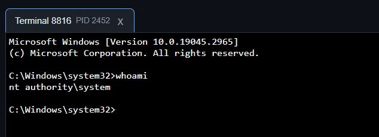

# remote-access-trojan

A Remote Access Trojan (RAT) with UEFI persistence.

## Features

- Reverse TCP shell for both Windows and Linux.
- OpenAPI-based management API, easily integrated with another web frontend.
- Kernel-mode self-defense (Windows only).
- Survive OS reinstall (but not hard-disk wipe, Windows only).

Because the trojan is executed as a Windows service, we automatically get a remote shell as *NT Authority\System*:

Of course, the self-defense feature can prevent user-mode processes from terminating our malware, even when we are already *NT Authority\System*.

