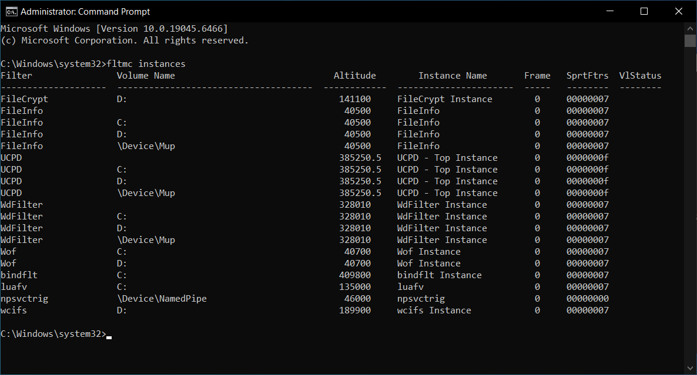
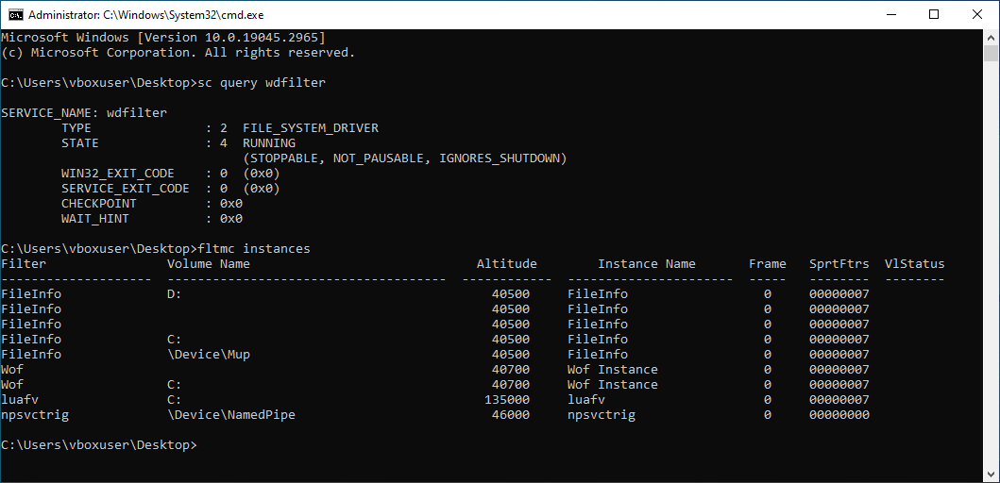
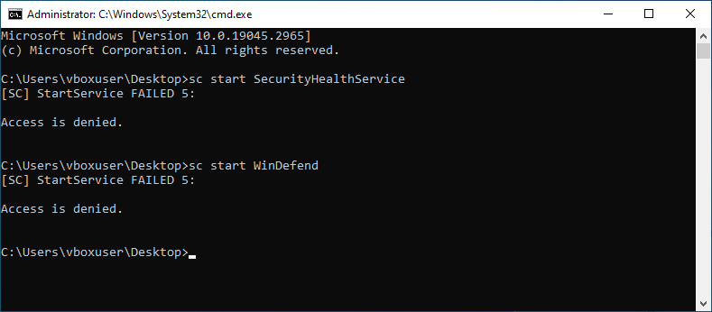

# remote-access-trojan

A full-featured Remote Access Trojan (RAT) written in Rust, with some fancy UEFI persistence tricks up its sleeve. It's built for both Windows and Linux, and it tries to stay stealthy while giving you remote control.

## What it can do

- Remote shell access on Windows (`conhost.exe`) and Linux (`/bin/bash`).
- Encrypted C&C communication over TCP with TLS (using `rustls`, so no OpenSSL headaches).
- A slick terminal frontend powered by [xterm.js](https://xtermjs.org/) in the operator panel.
- HTTP/2 management API based on OpenAPI - easy to hook up with a custom web UI.

### Windows-exclusive goodies

- Survives Windows "Reset this PC" (but not a fresh install from USB/DVD - that resets the boot order).
- Kernel-mode self-defense: prevents user-mode processes from messing with our processes or threads (no memory writes, suspensions, or terminations).
- Doesn't trip [PatchGuard](https://en.wikipedia.org/wiki/Kernel_Patch_Protection).
- Disables parts of Windows Defender (`WdFilter.sys` and related user-mode services).
- Obfuscated dropper using XOR with a 64‑byte key derived from the build timestamp (SHA512 hashed).
    - The [dropper](rat-dropper) is more of a helper tool. You can swap it with a batch script that:
        - Checks for UEFI boot and that Secure Boot is off.
        - Mounts the ESP.
        - Backs up `bootmgfw.efi` to `bootmgfw_old.efi`.
        - Drops `rat-efi` as `bootmgfw.efi` and also places `violet04.efi`.
        - Unmounts the ESP.
    - Besides obfuscation, the dropper can write directly to the ESP without mounting, which reduces the chance of being spotted by monitoring tools.

#### See it in action

Since the RAT runs as a Windows service, you get a remote shell as *NT Authority\System* right away:

The self-defense actually works - even when you're *System*, user-mode processes can't kill our malware:

Trying to terminate our threads? Nope. Even *Process Explorer* run by an Admin can't do it:

`WdFilter.sys` is the kernel driver for Windows Defender. Normally it attaches to the minifilter stack to monitor filesystem changes - you can see it with `fltmc instances`:

On an infected system, `sc query` still says it's "RUNNING", but no filter instances are attached. So it's basically a ghost driver:

And the user-mode Defender services? Blocked from starting altogether.

## How to build

### On Linux

Check out the [`Dockerfile`](/Dockerfile) for the full build steps.

### On Windows

Tested with Rust 1.96. You'll need:
- The `x86_64-pc-windows-msvc` target (default).
- The `x86_64-unknown-uefi` target.
- [`cargo-wdk`](https://crates.io/crates/cargo-wdk) - install with `cargo install cargo-wdk`. Tested with v0.1.1 (future versions might behave differently).
- Windows Driver Kit (WDK) build 26100.6584. Grab it from [here](https://learn.microsoft.com/en-us/windows-hardware/drivers/other-wdk-downloads) or use the installer at [`extern/wdksetup.exe`](extern/wdksetup.exe).

Once that's set, just run [`scripts/build.bat`](/scripts/build.bat) for a debug build. For release, use `scripts/build.bat release`. The script is designed to run from anywhere, so no need to `cd` into the repo root.

For more details, see the [`GitHub Actions config`](/.github/workflows/build.yml).

## Deployment

- Server:
  - Linux: `rat-server`
  - Windows: `rat-server.exe`
- Client:
  - Linux: `rat-client`
  - Windows: `rat-dropper.exe` (run once as Administrator)

Heads up: the TLS certificate used by the server must be signed by a root cert that the client trusts. The `rat-client` [build script](rat-client/build.rs) usually takes care of that for you.

## Known quirks

- The management API currently has no authentication or authorization - use with caution.

### Windows-only limitations

- UEFI persistence only works on specific Windows 10 and 11 versions.
- Secure Boot isn't bypassed yet - but check out [this repo](https://github.com/Wack0/CVE-2022-21894) for a proof-of-concept vulnerability.
- The C&C address is hard-coded in [`rat-driver`](rat-driver/src/global.rs). Right now there's no way to change it dynamically from the dropper without modifying the embedded binary.
